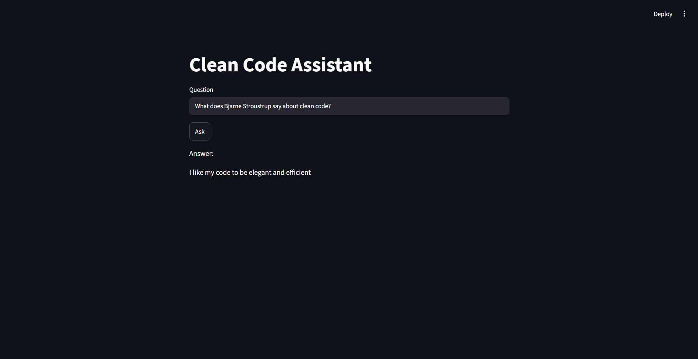

# Clean Code Assistant – RAG with Streamlit


This assistant answers questions based on Robert Martin's "Clean Code" book. It uses RAG (Retrieval-Augmented Generation) – finds relevant fragments and generates answers.

## How it works  
1. Book is split into chunks (1000 chars, 100 overlap)  
2. Chunks are embedded (with all-MiniLM-L6-v2 model) and indexed with FAISS  
3. User question → embedding → search → top 2 chunks  
4. Flan-T5-small generates answer based on found chunks  

## Tech stack 
- Sentence Transformers (embeddings)  
- FAISS (vector search)  
- Flan-T5-small (generation)  
- Streamlit (UI)

## Example

## Limitations
- Works best for direct quotes and specific facts  
- Small model (80M) may struggle with yes/no questions or synthesis  
- Context window limited to 512 tokens

## How to run 
```bash
#Install dependencies
pip install streamlit transformers faiss-cpu sentence-transformers 
#run the app
streamlit run app.py
```