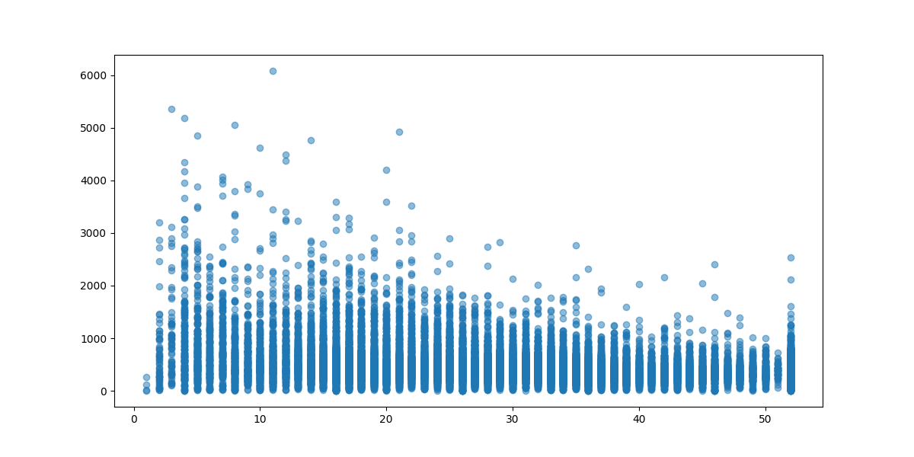

# California Housing - Data Cleaning

This script cleans the California Housing dataset.

## Dataset
[California Housing on Kaggle](https://www.kaggle.com/datasets/wasiqaliyasir/california-housing-dataset)

## Requirements
- pandas
- numpy
- matplotlib
- seaborn
## Visualizations (before cleaning)

### Households vs. Housing Median Age

## What it does
- Removes duplicates
- Fills missing values in numeric columns with mean
- Drops missing values in categorical columns
- Normalizes numerical columns (Min-Max)
- Saves cleaned data to a new file

## How to run

python script.py input.csv output.csv
 
## Results
After cleaning, all numerical columns are in range [0,1](Min-Max scaled).
