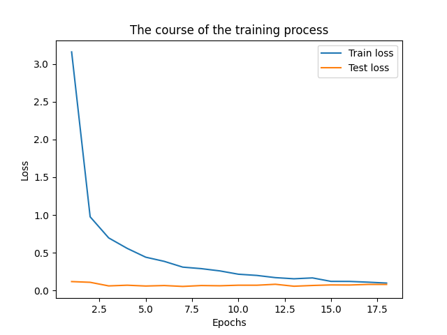
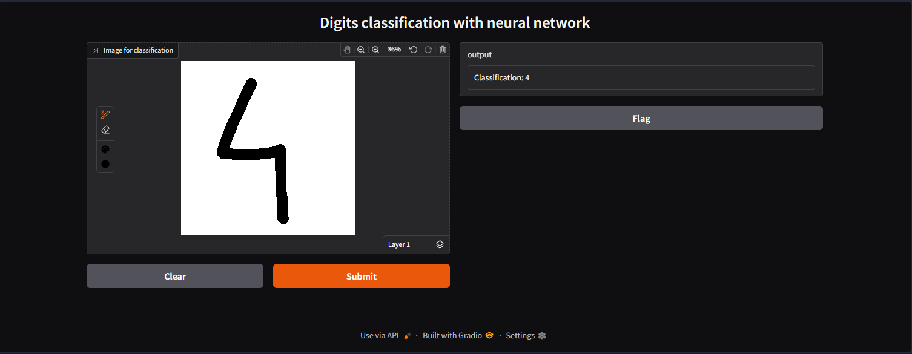

# MNIST Digit Classifier – PyTorch + Gradio

## Project Description
A convolutional neural network (CNN) built with PyTorch for handwritten digit recognition on the MNIST dataset.  
The model achieves **>99% accuracy** on the test set. A Gradio demo allows users to draw digits and classify them in real time.

## Technologies
- **PyTorch** – model building and training
- **Torchvision** – data preprocessing
- **Gradio** – user interface
- **NumPy, Matplotlib** – analysis and visualization

## Model Architecture
- Convolutional layers: 2 (32 and 64 filters, kernel 3x3)
- Pooling: MaxPool2d (2x2)
- Dropout: 0.25
- Fully connected layers: 3136 → 128 → 10
- Activation: ReLU
- Optimizer: Adam (lr=0.001)
- Loss function: CrossEntropyLoss

## Training Results
- **Test accuracy:** ~99.1%
- **Optimal epochs:** 18
- Loss and accuracy curves demonstrate stable learning.




## How to Run
```python
#Install dependencies
pip install torch torchvision gradio numpy matplotlib
#Run demo.py
python -m demo.py
```
## Example of classification


